# 🛍️ Stylish - E-Commerce Mobile App

<p align="center">
  
</p>

<p align="center">
  A modern, feature-rich e-commerce mobile application built with <strong>Flutter</strong>.<br/>
  Designed with clean architecture, state management via <strong>Cubit/Bloc</strong>, and a beautiful UI inspired by the Figma community kit.
</p>

<p align="center">
  
  
  
  
</p>

---
## 🎥 Video


https://github.com/user-attachments/assets/8c75f703-f47b-4e15-b16f-af1e7b313d37


---
## 📸 Screenshots

| Splash Screen | Onboarding 1 | Onboarding 2 | Onboarding 3 |
|:---:|:---:|:---:|:---:|
| 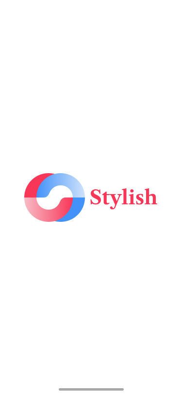 | 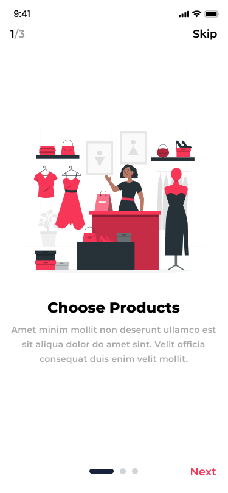 | 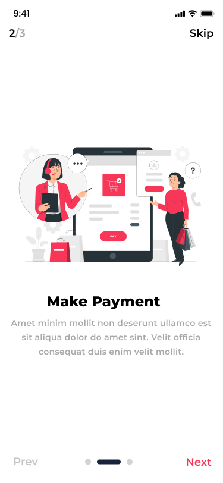 |  |

| Get Started | Sign In | Sign Up | Forgot Password |
|:---:|:---:|:---:|:---:|
| 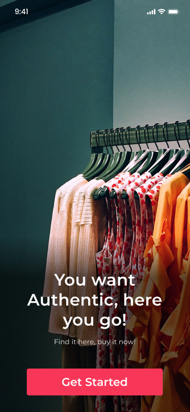 | 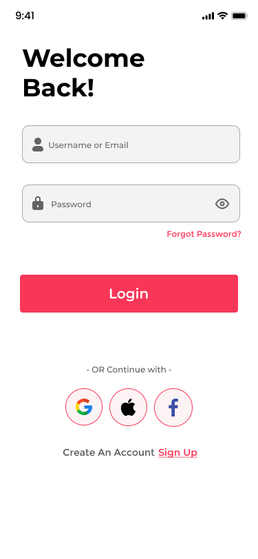 | 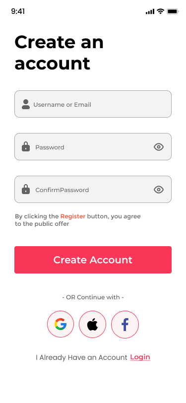 | 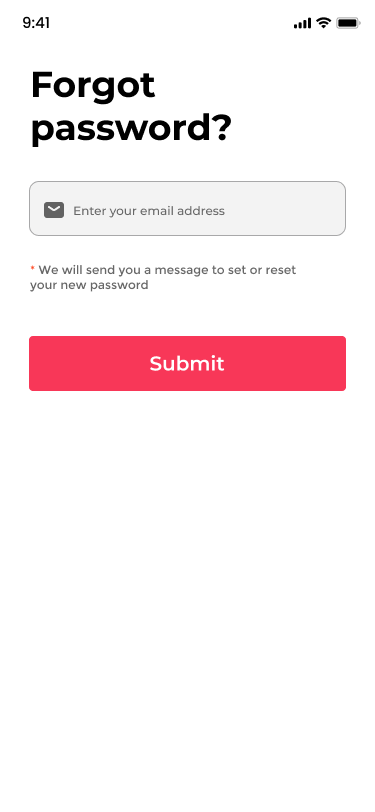 |

| Home Page | Shop Page | Trending Products | Profile |
|:---:|:---:|:---:|:---:|
| 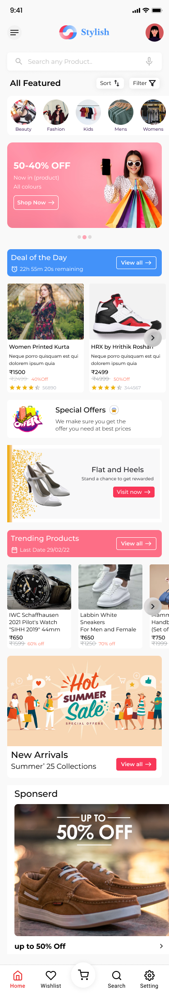 | 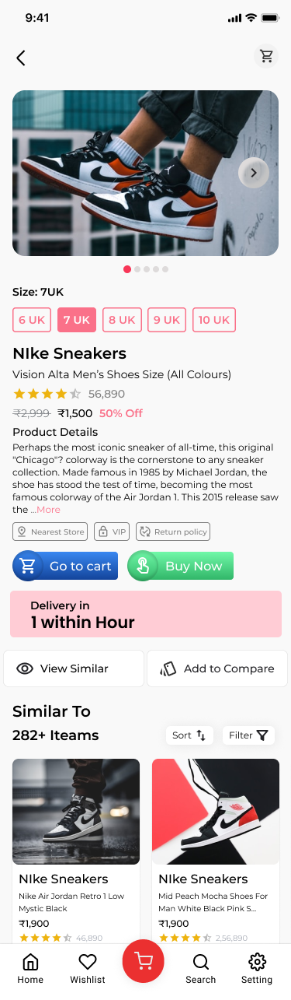 | 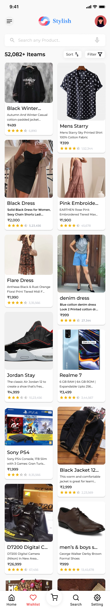 | 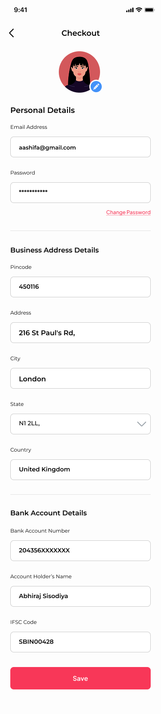 |

| Checkout | Shipping | Place Order | Successfully |
|:---:|:---:|:---:|:---:|
| 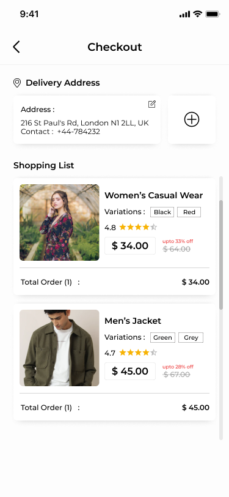 | 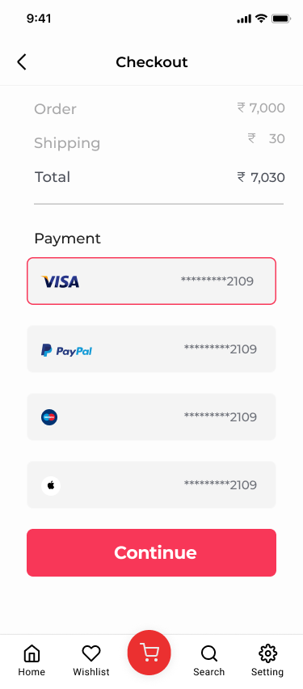 | 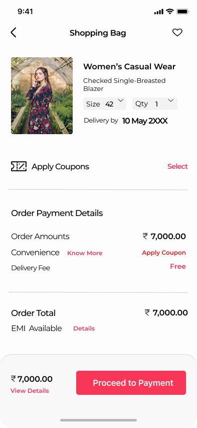 | 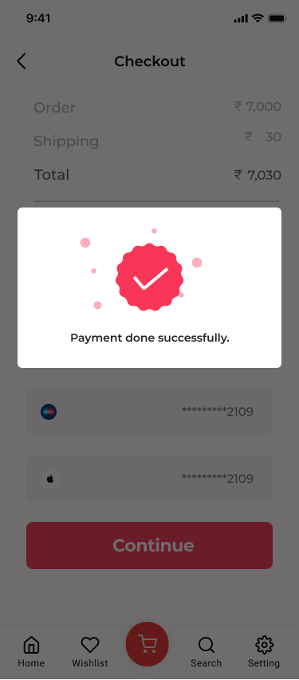 |

---

## 📁 Lib Structure

```text
lib/
├── main.dart                              # App entry point
│
├── config/                                # App-level configuration
│   ├── routing/
│   │   ├── app_router.dart                # GoRouter configuration & route definitions
│   │   └── app_routes.dart                # Route name constants
│   ├── services/
│   │   ├── secure_storage_service.dart    # Flutter Secure Storage wrapper
│   │   ├── services_locator.dart          # GetIt dependency injection setup
│   │   └── shared_preferences_service.dart# SharedPreferences wrapper
│   └── theme/
│       ├── app_theme.dart                 # Theme mode switcher
│       ├── dark_theme.dart                # Dark theme data
│       └── light_theme.dart               # Light theme data
│
├── core/                                  # Shared utilities & reusable components
│   ├── cache/
│   │   ├── cache_helper.dart              # Cache read/write operations
│   │   └── cache_key.dart                 # Cache key constants
│   ├── errors/
│   │   ├── error_model.dart               # Unified error model
│   │   └── exceptions.dart                # Custom exception classes
│   ├── functions/
│   │   ├── show_custom_dialog.dart        # Reusable dialog builder
│   │   └── show_snack_bar_function.dart   # SnackBar utility
│   ├── networking/
│   │   ├── api_consumer.dart              # Abstract API consumer interface
│   │   ├── api_end_points.dart            # API endpoints, keys & headers
│   │   ├── api_interceptor.dart           # Dio interceptors (auth, refresh, logging)
│   │   └── dio_consumer.dart              # Dio HTTP client implementation
│   ├── utils/
│   │   ├── app_assets.dart                # Generated asset path constants
│   │   ├── app_colors.dart                # Color palette constants
│   │   ├── app_constants.dart             # App-wide constants
│   │   └── app_text_styles.dart           # Typography styles
│   └── widgets/
│       └── custom_button.dart             # Reusable button widget
│
├── features/                              # Feature modules (Clean Architecture)
│   ├── Auth/
│   │   ├── data/
│   │   │   ├── models/
│   │   │   │   ├── signin_response_model.dart
│   │   │   │   ├── signup_model.dart
│   │   │   │   ├── signup_request_model.dart
│   │   │   │   ├── signup_response_model.dart
│   │   │   │   └── user_model.dart
│   │   │   └── repositories/
│   │   │       ├── auth_repo.dart                # Auth repository interface
│   │   │       └── auth_repo_implementation.dart  # Auth repository implementation
│   │   └── presentation/
│   │       ├── helpers/
│   │       │   ├── change_visibility.dart         # Password visibility toggle
│   │       │   └── validate_form_field.dart       # Form validation logic
│   │       ├── manager/
│   │       │   ├── get_user_data_cubit/           # Cubit for fetching user data
│   │       │   ├── log_out_cubit/                 # Cubit for logout
│   │       │   ├── signin_cubit/                  # Cubit for sign-in
│   │       │   └── signup_cubit/                  # Cubit for sign-up
│   │       ├── views/
│   │       │   ├── forget_password_view.dart
│   │       │   ├── login_view.dart
│   │       │   └── register_view.dart
│   │       └── widgets/
│   │           ├── custom_text_form_field.dart
│   │           ├── custom_title_screen_widget.dart
│   │           ├── forget_password_subtitle_text_widget.dart
│   │           ├── forget_password_text_widget.dart
│   │           ├── forget_password_view_body.dart
│   │           ├── login_form_widget.dart
│   │           ├── login_view_body.dart
│   │           ├── lower_text_widget.dart
│   │           ├── register_form_widget.dart
│   │           ├── register_subtitle_text_widget.dart
│   │           ├── register_view_body.dart
│   │           └── social_accounts_widgets.dart
│   │
│   ├── home/
│   │   └── presentation/
│   │       └── views/
│   │           └── home_view.dart                 # Main home screen
│   │
│   ├── onboarding/
│   │   ├── data/
│   │   │   ├── models/
│   │   │   │   └── onboarding_model.dart          # Onboarding data model
│   │   │   └── onboarding_items_list.dart         # Onboarding items data
│   │   └── presentation/
│   │       ├── views/
│   │       │   └── onboarding_view.dart           # Onboarding screen
│   │       └── widgets/
│   │           ├── lower_bar_widget.dart          # Bottom navigation bar
│   │           ├── onboarding_item.dart           # Single onboarding page
│   │           └── upper_bar_widget.dart          # Top skip/progress bar
│   │
│   └── splash/
│       └── presentation/
│           └── splash_view.dart                   # Animated splash screen
│
├── generated/                             # Auto-generated localization files
│   ├── intl/
│   └── l10n.dart
│
└── l10n/                                  # Localization resource files
    ├── intl_ar.arb                        # Arabic translations
    └── intl_en.arb                        # English translations
```

---

## ✨ Features

- 🔐 **Authentication** - Sign In, Sign Up & Forgot Password with JWT
- 🏠 **Home Page** - Browse trending products & categories
- 🛒 **Shop Page** - View all products with search & filter
- 📦 **Checkout Flow** - Shipping, Place Order & Success confirmation
- 👤 **User Profile** - View & manage user data
- 🌍 **Localization** - Multi-language support (English & Arabic)
- 🎨 **Theming** - Light & Dark mode support
- 🔄 **Token Refresh** - Automatic JWT token refresh with interceptor
- 🔒 **Secure Storage** - Secure credential storage using Flutter Secure Storage
- 📱 **Responsive UI** - Adaptive layouts with ScreenUtil
- 🚀 **Splash & Onboarding** - Smooth intro experience with native splash

---

## 🎨 Design

The UI is based on a community Figma design kit:

🔗 **Figma Design:** [eCommerce App UI Kit - Case Study Mobile App](https://www.figma.com/design/sxXKvqYly0rE9ADt8zy3QI/eCommerce-App-UI-Kit---Case-Study-Ecommerce-Mobile-App-UI-kit--Community-?node-id=0-1&t=T0KNTENLLfHDl9fe-1)

---

## 🌐 API Reference

This app uses the **Platzi Fake Store API** as its backend.

🔗 **API Documentation:** [https://fakeapi.platzi.com/](https://fakeapi.platzi.com/)

**Base URL:**
```text
https://api.escuelajs.co/api/v1/
```

### Endpoints Used

| Method | Endpoint | Description |
|--------|----------|-------------|
| `POST` | `/auth/login` | Login with email & password, returns JWT tokens |
| `POST` | `/auth/refresh-token` | Refresh expired access token |
| `GET` | `/auth/profile` | Get authenticated user profile (Bearer token required) |
| `POST` | `/users/` | Register a new user |
| `GET` | `/users/{id}` | Get a single user by ID |
| `PUT` | `/users/{id}` | Update user data |
| `POST` | `/users/is-available` | Check email availability |
| `POST` | `/files/upload` | Upload a file (multipart/form-data) |
| `GET` | `/files/{fileName}` | Retrieve an uploaded file |

### Authentication Flow

```text
1. POST /auth/login          -> { access_token, refresh_token }
2. GET  /auth/profile        -> User data (with Bearer token)
3. POST /auth/refresh-token  -> New { access_token, refresh_token }
```

> **Note:** Access token is valid for **20 days**, refresh token is valid for **10 hours**.

### Example - Login Request

```json
POST https://api.escuelajs.co/api/v1/auth/login
Content-Type: application/json

{
  "email": "john@mail.com",
  "password": "changeme"
}
```

### Example - Login Response

```json
{
  "access_token": "eyJhbGciOiJIUzI1NiIsInR5cCI6IkpXVCJ9...",
  "refresh_token": "eyJhbGciOiJIUzI1NiIsInR5cCI6IkpXVCJ9..."
}
```

### Example - Create User

```json
POST https://api.escuelajs.co/api/v1/users/
Content-Type: application/json

{
  "name": "Nicolas",
  "email": "nico@gmail.com",
  "password": "1234",
  "avatar": "https://picsum.photos/800"
}
```

---

## 📦 Dependencies

| Package | Version | Purpose |
|---------|---------|---------|
| `flutter_bloc` | ^9.1.1 | State management (Cubit/Bloc) |
| `bloc` | ^9.2.1 | Bloc core library |
| `dio` | ^5.9.2 | HTTP client for API calls |
| `go_router` | ^17.2.3 | Declarative routing |
| `get_it` | ^9.2.1 | Service locator / Dependency injection |
| `dartz` | ^0.10.1 | Functional programming (Either type) |
| `flutter_secure_storage` | ^10.3.1 | Encrypted secure storage |
| `shared_preferences` | ^2.5.5 | Local key-value storage |
| `jwt_decoder` | ^2.0.1 | JWT token parsing & validation |
| `flutter_screenutil` | ^5.9.3 | Responsive UI scaling |
| `flutter_svg` | ^2.3.0 | SVG rendering |
| `smooth_page_indicator` | ^2.0.1 | Page indicator for onboarding |
| `internet_connection_checker_plus` | ^3.0.0 | Network connectivity check |
| `flutter_native_splash` | ^2.4.7 | Native splash screen |
| `flutter_launcher_icons` | ^0.14.4 | App icon generation |
| `flutter_localizations` | SDK | Multi-language support |

---

## 🚀 Getting Started

### Prerequisites

- Flutter SDK `^3.10.8`
- Dart SDK `^3.10.8`

### Installation

```bash
# Clone the repository
git clone https://github.com/ahmed-eltantawi/Stylishe-e-commerce-app.git

# Navigate to the project directory
cd stylish

# Install dependencies
flutter pub get

# Run the app
flutter run
```

### Generate Splash Screen & Launcher Icons

```bash
# Generate native splash screen
dart run flutter_native_splash:create

# Generate launcher icons
dart run flutter_launcher_icons
```

---

## 🏗️ Architecture

This project follows **Clean Architecture** principles with a feature-first structure:

```text
Feature/
├── data/           -> Models, Repositories (data sources)
└── presentation/   -> Views, Widgets, Cubits (state management)
```

**State Management:** Cubit (`flutter_bloc`) - lightweight, predictable state management.

**Dependency Injection:** GetIt service locator for decoupled, testable code.

**Networking:** Dio with custom interceptors for authentication, token refresh, and error handling.

---

## 📝 License

This project is for educational and internship purposes.

---

<p align="center">
  Made with ❤️ using Flutter
</p>
